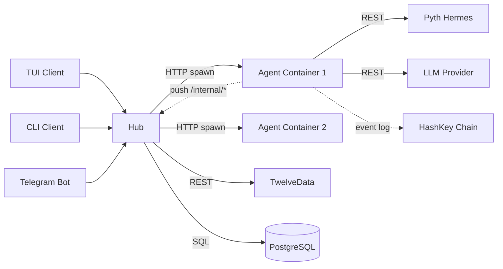

# System Architecture — Artic

## Overview

Hub-and-spoke architecture. A central **hub** server manages user auth, agent lifecycle, market cache, and client connections. Each trading **agent** runs as an isolated Docker container with its own FastAPI instance. **Clients** (TUI, CLI, Telegram) connect only to the hub.

## Module Responsibilities

| Module | Responsibility |
|--------|---------------|
| **Hub** (`/hub/`) | Auth (JWT + API key), agent CRUD, Docker management, market cache, WebSocket streaming, secrets, PostgreSQL |
| **App** (`/app/`) | Trading engine: tick loop, LLM planning, strategy execution, paper/HashKey execution |
| **Strategies** (`/app/strategies/`) | 30+ quant algorithms, signal dispatcher |
| **Clients** (`/clients/`) | Thin presentation layers — all state lives in the hub |

## System Topology

## Data Flow

- **Candles**: TwelveData → Hub cache (APScheduler, 60s staleness) → Agents fetch from hub
- **Live prices**: Pyth Hermes → Agent directly (free, no rate limit)
- **Status/trades/logs**: Agent pushes to Hub via `/internal/*` (X-Internal-Secret)
- **On-chain**: Supervisor decisions → `DecisionLogged` event on HashKey Chain

## Key Invariants

- **Agents are stateless across restarts** — persistent state in hub PostgreSQL
- **Clients never talk to agent containers** — hub proxies everything
- **One agent = one symbol** — each container trades one asset
- **API keys never stored in plaintext** — encrypted in DB or injected ephemeral
- **Agent→Hub is push-based** — agents POST to hub, hub doesn't poll for state
- **Hub owns TwelveData rate budget** — agents fetch candles from hub cache only
